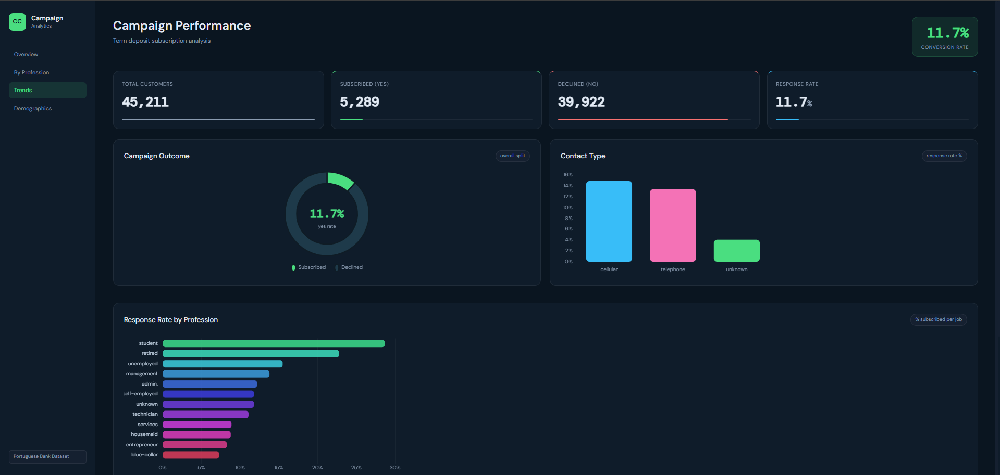

# Customer Campaign Performance Analysis Dashboard

An interactive analytics dashboard built using Flask, Plotly, HTML, CSS, and SQL to analyze customer engagement in banking campaigns.

## Live Demo

https://customer-campaign-performance-analysis.onrender.com/

## Dashboard Preview

## Features

- KPI metrics dashboard  
- profession-based response analysis  
- campaign outcome visualization  
- response trend insights  
- production deployment with automatic GitHub updates  

## Tools Used

- Python  
- Flask  
- Plotly  
- HTML  
- CSS  
- SQL  

## Dataset

Portuguese Bank Marketing Dataset

## Project Architecture

Raw Dataset → Summary Generation → Flask Backend → Plotly Visualization → HTML/CSS Frontend → Render Deployment

## Run Locally

python app.py